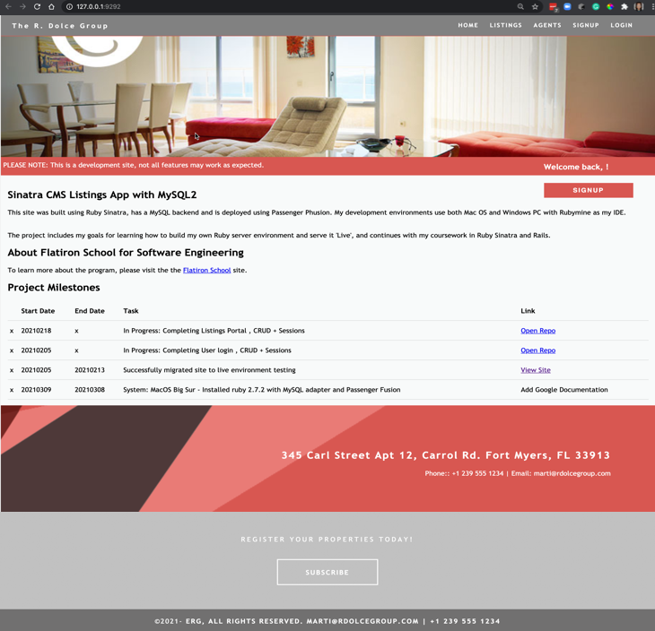
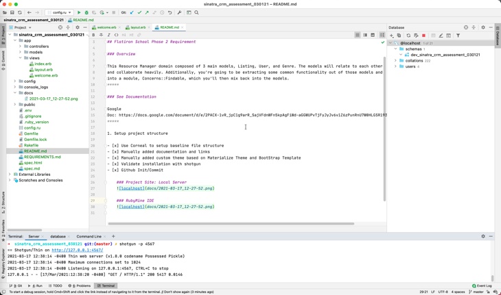
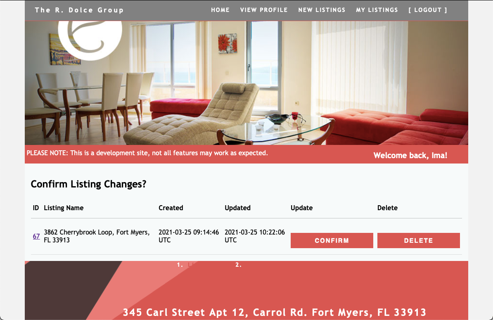

# Sinatra-MySQL Resource Manager

## Flatiron School Phase 2 Requirement

### Overview

This Resource Manager domain composed of 3 main models, Listing, User, and Roles. The models will relate to each other
and collaborate heavily.

This project presents concepts such as var_instantiated_object = class.method.action

`ex: search = Role.find_by_id(params[:id])`
*****

### See Documentation

Part 1: Visual Planning - Coming Soon

Part 2: https://docs.google.com/document/d/1LJC_DwA8NK7IKWNCuGDUD5rEKlbdnzk_HzWBZz_ofPw/edit#

Part
3: https://docs.google.com/document/d/e/2PACX-1vR_jpC1g9arR_SajVFdnWFn5kpAgFiWd-aGGWUPvTjFyJyJv6v1Z6zPunRnU7W0HLGSR193bvL-pDSz/pub

Github Repo: https://github.com/Marti-Dolce-Flatiron-School-Projects/sinatra_crm_assessment_030121
Project
Details:  https://github.com/Marti-Dolce-Flatiron-School-Projects/sinatra_crm_assessment_030121/projects/1?add_cards_query=is%3Aopen

*****

1. Setup project structure

- [x] Use Corneal to setup baseline file structure
- [x] Manually added documentation and links
- [x] Manually added custom theme based on Materialize Theme and BootStrap Template
- [x] Validate installation with shotgun
- [x] Github Init/Commit
- [x] Establish Development Workflow + Use Cases
- [x] Include Sample Database *.sql
- [ ] Add vision board to documentation

  ### Project Site: Local Server
  

  ### RubyMine IDE
  

2. Setup Roles MVC: A Role, belongs_to :user.

   #### Documentation:
   https://github.com/faker-ruby/faker/blob/master/lib/locales/README.md
   https://github.com/faker-ruby/faker#customization

   Add requirements for Roles migration/seed
    - [x] Created DB migration files
    - [x] Create table Roles
    - [x] Added Roles MVC
    - [x] Added Roles Seeds
    - [x] Verify database/objects appear in database
    - [x] Verify CRUD
    - [ ] Bonus:  Add validations

3. Setup Users MVC: A User, has_many :listings and has_one role

    Add requirements for Users migration/seed
    - [x] Created DB migration files
    - [x] Create table Users
    - [x] Added Users MVC #ToDo - Add Active/Inactive via cancel btn on user dashboard Try{ - [ ] conditional wrapper
      for hiding listings if status is inactive - [ ] conditional new button for renew registration on dashboard if
      inactive }
    - [x] Added User Seeds
    - [x] Verify database/objects appear in database
    - [x] Verify CRU (No deleting users) see #ToDo
    - [ ] Bonus:  Add validations

4. Setup Listings MVC: A Listing, belongs_to :user

   Add requirements for listings migration/seed
   - [x] Created DB migration files
   - [x] Add Migration: add_role_and_listing_references_to_user
   - [x] Create table Listings
   - [x] Added Listings Seeds
   - [x] Verify database/objects appear in database
   - [x] Verify CRUD 
   - [ ] Bonus:  Add validations
   
 5. Additional Features
    - [x] Confirmation page for editing/deleting listings
        